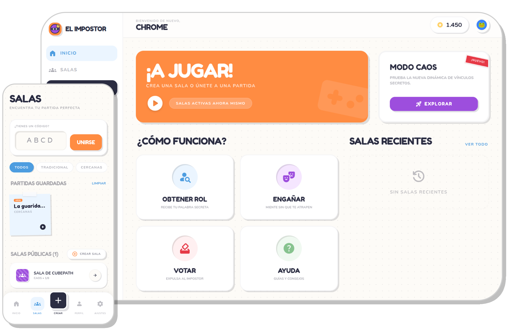

# 🕵️‍♂️ El Impostor - Hackatón CubePath 2026

> **El Impostor** es un juego social de engaño, deducción y sutileza, diseñado para jugarse tanto en persona ("Pasar el teléfono") como en línea. Este proyecto fue desarrollado y optimizado para la infraestructura de **CubePath 2026**, desplegado exitosamente en un servidor **gm.micro**.



---

## 🎮 ¿De qué trata?

Inspirado en clásicos de deducción social, el objetivo principal es **no ser descubierto** o **identificar al infiltrado** mediante pistas sutiles.

### Modos de Juego
- **🕵️ Tradicional (Local/Online):** 1 Impostor (sin palabra) vs N-1 Agentes (misma palabra). El impostor debe deducir la palabra escuchando a los demás.
- **🔍 Palabras Cercanas (Local/Online):** 1 Infiltrado (Palabra B) vs N-1 Agentes (Palabra A). Las palabras son semánticamente similares (ej. "Pizza" vs "Calzone"). El infiltrado cree que es un agente hasta que nota las inconsistencias.
- **⚡ Modo Caos (Solo Online):** 2 Vinculados (misma palabra) vs N-2 Dispersos (palabras únicas relacionadas). Los vinculados deben encontrarse; los dispersos deben acusar a la pareja.

---

## 🏗️ Arquitectura del Sistema

El sistema esta basado en un **Monorepo** gestionado por **Bun** y orquestado con **Turborepo**.

### Componentes Principales
1.  **API Backend (`apps/api`):** 
    - Desarrollado con **Hono**.
    - Gestiona persistencia (PostgreSQL), autenticación silenciosa y orquestación de IA.
2.  **Game Server (`apps/game-server`):**
    - Runtime nativo de **Bun** para WebSockets de alta performance.
    - Mantiene el estado de las partidas en RAM y gestiona la máquina de estados en tiempo real.
3.  **Frontend Web (`apps/web`):**
    - SPA construida con **React 19**, **Vite** y **Tailwind CSS v4**.
    - Gestión de estado con **Zustand**.
4.  **Shared Core (`packages/shared`):**
    - Contratos de validación con **Zod** y tipos de TypeScript compartidos.

---

## 🛠️ Stack Tecnológico

- **Runtime:** [Bun](https://bun.sh/) (Gestión de paquetes, ejecución y WebSockets).
- **Frontend:** React + Vite + TypeScript + Tailwind CSS + Zustand.
- **Backend:** Hono (API) + Bun Native (WS).
- **IA:** Google Gemini API para generación dinámica de palabras y temas.
- **Base de Datos:** PostgreSQL (cliente nativo `postgres.js`).
- **Orquestación:** Turborepo para builds paralelos y caché.

---

## 🔑 Variables de Entorno

### 📡 API (`apps/api`)
| Variable | Descripción |
| :--- | :--- |
| `DATABASE_URL` | Conexión a PostgreSQL |
| `ALLOWED_ORIGINS` | Lista blanca de dominios para CORS |
| `INTERNAL_API_KEY` | Clave secreta para comunicación entre servidores (S2S) |
| `GEMINI_API_KEY` | API Key de Google Gemini AI |

### 🎮 Game Server (`apps/game-server`)
| Variable | Descripción |
| :--- | :--- |
| `INTERNAL_API_KEY` | Debe coincidir con la de la API |

### 🌐 Web (`apps/web`)
| Variable | Descripción |
| :--- | :--- |
| `VITE_API_URL` | URL base de la API REST |
| `VITE_WS_URL` | URL del servidor de WebSockets (wss://...) |

---

## ☁️ Despliegue en CubePath (gm.micro)

Este proyecto está configurado para ejecutarse en un servidor **gm.micro** (2 vCPU, 4GB RAM) utilizando **Dockploy**.

### 📉 Límites de Memoria por Servicio
Para garantizar la estabilidad en el servidor de 4GB, se han establecido los siguientes límites:

| Servicio | Límite RAM | Notas |
| :--- | :--- | :--- |
| **PostgreSQL** | `1 GB` | Persistencia de datos |
| **API Backend** | `512 MB` | Gestión de peticiones HTTP |
| **Game Server** | `512 MB` | Lógica de WebSockets en RAM |
| **Frontend (Nginx)** | `256 MB` | Servicio de archivos estáticos |

---

## 📖 Documentación Detallada

Para más información técnica, consulta la carpeta `docs/`:
- **[Arquitectura](docs/ARCHITECTURE.md):** Patrones de diseño y flujos.
- **[API Reference](docs/API.md):** Endpoints y eventos de Socket.
- **[Base de Datos](docs/DATABASE.md):** Esquemas y diagramas ER.
- **[Flujo de Usuario](docs/USER_FLOW.md):** Experiencia "Guest-First".
- **[Guía de Desarrollo](docs/DEVELOPMENT.md):** Cómo contribuir.

---
## ⚙️ Configuración Local

1. **Instalar dependencias:**
   ```bash
   bun install
   ```
2. **Iniciar desarrollo:**
   ```bash
   bun run dev
   ```
   *O usa `bun run dev:kitty` si usas el terminal Kitty para una experiencia multi-ventana.*

3. **Base de Datos:**
   Asegúrate de tener Postgres corriendo y ejecuta la migración inicial desde `apps/api`.

---

Desarrollado con ❤️ para la **Hackatón CubePath 2026**.
