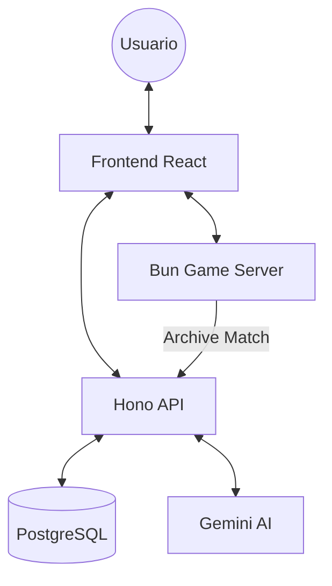

# Arquitectura del Sistema: El Impostor

El juego utiliza una arquitectura de microservicios ligera basada en **Monorepo** (pnpm workspaces) para maximizar la reutilización de código y contratos.

## Componentes Principales

### 1. API Backend (`apps/api`)
- **Framework**: Hono (Ultrarrápido, compatible con múltiples runtimes).
- **Persistencia**: PostgreSQL (usando `postgres.js`).
- **Responsabilidades**:
  - Autenticación silenciosa (Guest-First).
  - Gestión de perfiles y estadísticas persistentes.
  - Almacenamiento histórico de salas y partidas.
  - Orquestación de IA (Gemini API) para generación de palabras.

### 2. Servidor de Juego (`apps/game-server`)
- **Runtime**: Bun (WS nativo de alta performance).
- **Comunicación**: WebSockets en tiempo real.
- **Responsabilidades**:
  - Estado efímero de las salas en RAM.
  - Máquina de estados del juego (Lobby -> Assigning -> Clues -> Discussing -> Voting -> Results).
  - Comunicación bidireccional entre jugadores.
  - Reporte de resultados a la API al finalizar la partida.

### 3. Frontend Web (`apps/web`)
- **Framework**: React + Vite + Tailwind CSS.
- **Estado**: Zustand (gestión de auth y socket).
- **Responsabilidades**:
  - Experiencia de usuario dinámica y responsiva.
  - Interfaz de "Guest-First" con registro Just-in-Time.
  - Visualización premium con animaciones y feedback visual.

### 4. Shared Package (`packages/shared`)
- **Contratos**: Esquemas Zod que validan la comunicación entre todos los componentes.
- **Tipos**: Definiciones TypeScript compartidas para evitar duplicación.

## Diagrama de Comunicación

