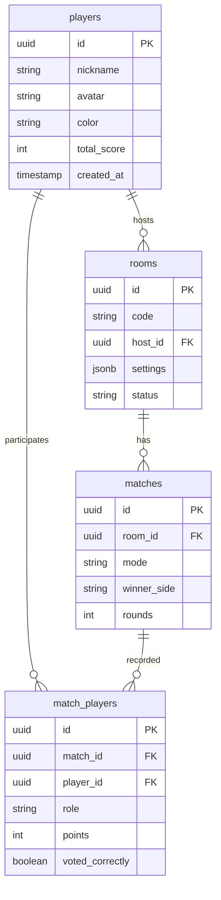

# Esquema de Base de Datos

El sistema utiliza PostgreSQL para la persistencia de datos. El diseño se enfoca en la extensibilidad para futuros modos de juego.

## Diagrama ER (Simplificado)



## Detalles de Tablas

### `players`
Almacena la identidad del usuario. Los invitados se crean localmente y se promocionan a esta tabla cuando eligen un nombre de usuario real.

### `match_players`
Contiene el desglose de cada partida. Es la fuente de la verdad para calcular la **Eficacia de Voto** y las victorias por rol.

## Esquemas Zod (Contratos)

Los contratos S2S (Server-to-Server) y Client-to-Server están definidos en `@impostor/shared`.

### Registro de Partida (`matchResultSchema`)
```typescript
{
  roomId: string,
  winnerSide: 'AGENTES' | 'IMPOSTORES' | 'CAOS',
  mode: 'TRADICIONAL' | 'CERCANAS' | 'CAOS',
  rounds: number,
  players: [
    {
      playerId: string,
      role: string,
      pointsEarned: number,
      votedCorrectly: boolean
    }
  ]
}
```
