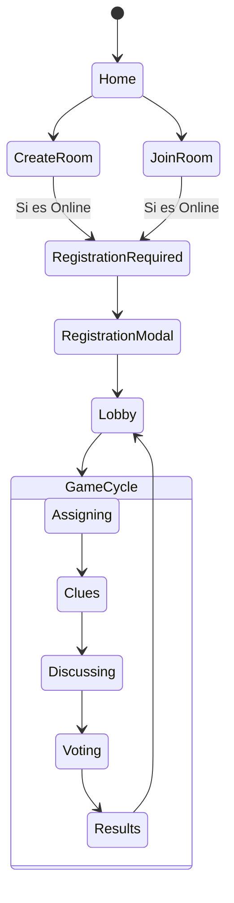

# Flujo de Usuario y Experiencia

El juego prioriza la fricción mínima para entrar (Guest-First) pero incentiva la persistencia para el seguimiento de carrera.

## 1. Entrada al Juego (Onboarding)
- **Invitado**: El usuario entra, elige un Avatar y Color. Se le asigna un ID temporal en el frontend.
- **Navegación**: Puede unirse a partidas locales o ver la lista de salas sin registrarse.

## 2. Registro Just-in-Time
- **Disparador**: Intentar crear una sala online o unirse a una requiere identidad persistente.
- **Acción**: Se muestra el `RegistrationModal`.
- **Backend**: El ID de invitado se envía al servidor, que crea un registro real en la DB y devuelve el UUID permanente. Las estadísticas de la sesión se transfieren al nuevo perfil.

## 3. Ciclo de Partida (Core Loop)
1. **Lobby**: El Host configura la sala. Los jugadores se preparan.
2. **Assigning**: La IA genera la palabra secreta. Se asignan roles de forma privada.
3. **Clues**: Por turnos, cada jugador da una pista de UNA palabra.
4. **Discussing**: Debate abierto (o por chat) sobre quién miente.
5. **Voting**: Votación simultánea.
6. **Results**: Revelación de roles, cálculo de puntos y actualización de estadísticas.

## Diagrama de Flujo

